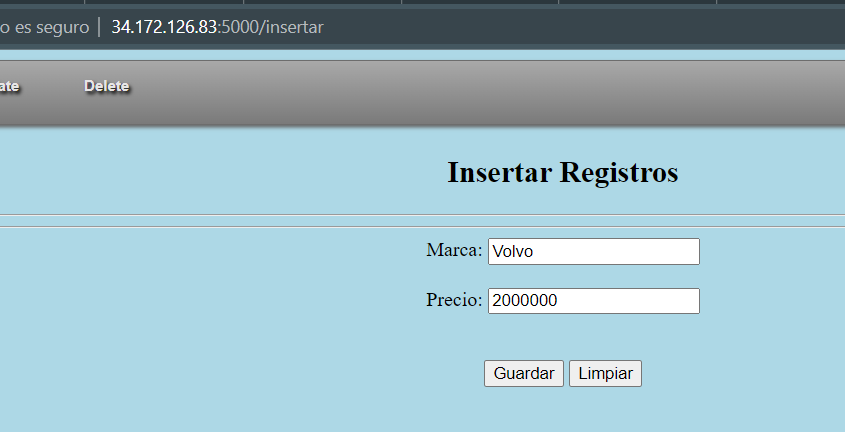

# Clase 01 - Semana 10
## Bases de datos avanzadas

Considerar:
> Objetivo del trabajo: Crear una arquitectura elástica y escalable automáticamente que albergue sistema que utilice fuentes de información estructurada y no estructurada para evaluar y predecir el comportamiento de una acción en la bolsa de valores.
El sistema debe poder identificaar factores externos que afecten a los indices


- - - 

### Inicializando la instancia de máquina virtual

Se realiza la inicialización de la instancia de máquina virtual..

- - -

Ingresamos al directorio Proyectos

```shell
cd Proyectos
```

Realizamos una copia del directorio *ejemplo06* a *ejemplo07*

```shell
cp -fR ejemplo06 ejemplo07
```

Ingresamos al directorio *ejemplo07*
```shell
cd ejemplo07
```

Ejecutamos la aplicación de flask
```shell
export FLASK_APP=vista.py
flask run --host=0.0.0.0
```

Ingresamos en el archivo *templates/insertar.html*

```html
<!DOCTYPE html>
 <html>
  <head>
    <meta charset="UTF-8">
    <meta content="width=device-width, initial-scale=1, maximum-scale=1, user-scalable=no">
    <link rel="stylesheet" href="{{ url_for('static', filename='css/estilo.css') }}">
    <title>Muestra Datos de la Base de Datos</title>
  </head>
 <body>
 <!-- Cuerpo del documento  -->
 <!-- Creando liga a documentos -->
    <ul id="menu-bar">
        <li><a href="/">Main</a></li>
        <li><a href="/ver">Select</a>
        </li>
        <li class="active"><a href="/insertar"><span id="active">Insert</span></a>
        </li>
        <li><a href="#">Update</a></li>
        <li><a href="#">Delete</a></li>
    </ul>
  <!-- Creando liga a documento -->
 <!-- Inicio del cuerpo del documento -->
 <center>
  <h2>Insertar Registros</h2>
  <hr><hr>
  <!-- Inicio de la forma, indicar si muestra o no los parámetros y a dónde los manda -->
  <form method="POST" action="/insert">
   <label for="Nombre">Marca: </label>
   <input type="text" name="nombre" required></br>
   <br>
   <label for="Precio">Precio: </label>
   <input type="number" name="pre" required></br>
   <br>
   <br>
   <input type="submit" value="Guardar">
   <input type="reset" value="Limpiar">
  </form>
 <!-- Fin del cuerpo del documento -->
 </body>
</html>
```

Ahora ingresaremos al archivo *vista.py*

```py
from flask import Flask, render_template
## Importamos la librería flask_mysqldb
# Con ello pemrmitirá conectar con la DB
from flask_mysqldb import MySQL

app = Flask(__name__)
mysql = MySQL(app)

###
# Datos de acceso a la Base de Datos
app.config['MYSQL_HOST']='localhost'
app.config['MYSQL_USER']='agencia_user'
app.config['MYSQL_PASSWORD']='666'
app.config['MYSQL_DB']='Agencia'

print("Conexión exitosa")

## Creando ruta
@app.route('/')
def inicio():
    return render_template('index.html')

## Acceder a la base de datos y mostrar registros
@app.route('/ver', methods=['GET'])
def ver_datos():
    cursor = mysql.connection.cursor()
    # Ejecutamos la sentencia SQL para obtener todo
    cursor.execute('''SELECT id,Modelo,Precio FROM Autos''')
    # Almacenamos todo lo necesario en nuestra variable Autos, a través del método fetchall()
    Autos = cursor.fetchall()

    # Enviaremos los datos hacia el pagina.html donde Jinja2 los recepcionará
    return render_template('pagina.html', Autos=Autos)

@app.route('/insertar', methods=['GET'])
def insert():
    return render_template('insertar.html')

@app.route('/insert', methods=['GET','POST'])
def insert():
    if request.method == 'GET':
        return "M&eacute;todo err&oacute;neo, favor de usar el correcto"
    if request.method == 'POST':
        nombre = request.form['nombre']
        precio = request.form['pre']
        cursor = mysql.connection.cursor()
        cursor.execute(''' INSERT INTO Autos (Nombre, Precio) VALUES (%s,%s) ''',(nombre, precio))
        mysql.connection.commit()
        cursor.close()
        return ver_datos()

if __name__ == '__main__':
    app.run(debug=True)
```

Insertaremos los datos


- - -

Modificaremos la vista para que aparezca el ID, Marca, Modelo, Precio

De este modo, editaremos el archivo vista.py. De modo que, la función de ver datos pueda recopilar los Nombres también

```py
## Acceder a la base de datos y mostrar registros
@app.route('/ver', methods=['GET'])
def ver_datos():
    cursor = mysql.connection.cursor()
    # Ejecutamos la sentencia SQL para obtener todo
    cursor.execute('''SELECT id,Nombre, Modelo,Precio FROM Autos''')
    # Almacenamos todo lo necesario en nuestra variable Autos, a través del método fetchall()
    Autos = cursor.fetchall()

    # Enviaremos los datos hacia el pagina.html donde Jinja2 los recepcionará
    return render_template('pagina.html', Autos=Autos)
```

Asimismo, el archivo pagina.html será modificado de la siguiente manera
```html
<!DOCTYPE html>
 <html>
  <head>
    <meta charset="UTF-8">
    <meta content="width=device-width, initial-scale=1, maximum-scale=1, user-scalable=no">
    <link rel="stylesheet" href="{{ url_for('static', filename='css/estilo.css') }}">
    <title>Muestra Datos de la Base de Datos</title>
  </head>
 <body>
 <!-- Cuerpo del documento  -->
 <!-- Creando liga a documentos -->
    <ul id="menu-bar">
        <li><a href="/"><span id="active">Main</span></a></li>
        <li class="active"><a href="#"><span id="active">Select</span></a>
        </li>
        <li><a href="/insertar">Insert</a>
        </li>
        <li><a href="#">Update</a></li>
        <li><a href="#">Delete</a></li>
    </ul>
  <!-- Creando liga a documento -->
 <center>
  <h2>Lista de Autos</h2>
  <hr><hr>
  <table>
  <!-- Definicion de encabezado y columnas -->
   <thead>
    <tr>
     <th>ID</th>
     <th>Marca</th>
     <th>Modelo</th>
     <th>Precio</th>
    </tr>
   </thead>
  <!-- Definicion del cuerpo de la tabla con dato manipulados con Jinja -->
   <tbody>
      
      <tr>
        <td> {{ auto[0] }} </td>
        <td> {{ auto[1] }} </td>
        <td> {{ auto[2] }} </td>
        <td> {{ auto[3] }} </td>
      </tr>
      
   </tbody>
  </table>
 <!-- Fin del cuerpo del documento -->
 </body>
</html>
```

De este modo, se mosstrará en la vista la Marca del vehículo

- - -

### Realizando el DELETE

De este modo, se agrega la función
```py
#### Borrado de datos
@app.route('/borrar/<string:id>')
def borrar(id):
    cursor = mysql.connection.cursor()
    cursor.execute(''' DELETE FROM Autos WHERE id=%s ''', (id,))
    mysql.connection.commit()
    cursor.close()
    return ver_datos()
```

De este modo, al ingresar al enlace
```
/borrar/3
```

Se borrará el elemento con ese id
