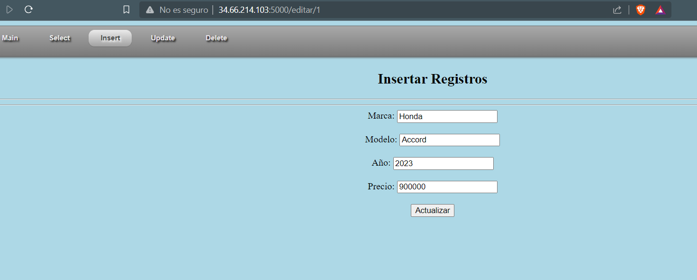

# Clase 01 - Semana 11
## Bases de datos avanzadas

Ingresamos al directorio de *Proyectos*
```
cd Proyectos
```

Realizamos una copia del ejemplo07 al ejemplo08
```
cp -fR ejemplo07 ejemplo08
```

Verificamos lo realizado en vista.py
```
vi vista.py
```
### Actualización de datos
Ahora, realizaremos la actualización de los datos

```shell
#### Actualización de datos
@app.route('/editar/<string:id>')
def editar(id):
    cursor = mysql.connection.cursor()
    cursor.execute("SELECT id, Nombre, Modelo, Anio, Precio FROM Autos WHERE id = %s",(id,))
    autos = cursor.fetchall()
    return render_template('forma_update.html', autos=autos[0])
```

Ingresamos al directorio templates
```
cd templates
```

Copiamos el insertar.html hacia form_update.html
```shell
cp insertar.html forma_update.html
```

Ingresamos en templates
```shell
vi forma_update.html
```

Ahora, ingresamos en la sección del body y modificamos el formulario.
```html
  <form method="POST" action="/actualizar/{{ autos.0 }}">
   <label for="Nombre">Marca: </label>
   <input type="text" name="nombre" value="{{ autos.1 }}"></br>
   <br>
   <label for="Modelo">Modelo: </label>
   <input type="text" name="m" value="{{ autos.2 }}"></br>
   <br>
   <label for="Anio">Año: </label>
   <input type="text" name="anio" value="{{ autos.3 }}"></br>
   <br>
   <label for="Precio">Precio: </label>
   <input type="text" name="pre" value="{{ autos.4 }}"></br>
   <br>
   <input type="submit" value="Actualizar">
  </form>
```

Ingresamos a vista.py
```
vi vista.py
```
Agregamos esto
```py
@app.route('/actualizar/<string:id>', methods=['GET','POST'])
def actualizar(id):
    if request.method == 'GET':
        return "M&eacute;todo err&oacute;neo, favor de usar el correcto"
    if request.method == 'POST':
        nombre = request.form['nombre']
        precio = request.form['pre']
        modelo = request.form['m']
        anio = request.form['anio']
        cursor = mysql.connection.cursor()
        cursor.execute(" UPDATE Autos SET Nombre=%s, Modelo=%s, Anio=%s, Precio=%s WHERE id = %s",(nombre, modelo, anio, precio, id))
        mysql.connection.commit()
        cursor.close()
        return ver_datos()
```

Ejecutamos la aplicación Flask
```shell
export FLASK_APP=vista.py
flask run --host=0.0.0.0
```

Al ejecutar e ingresar a la ruta, se podrá visualizar



Si modificamos, tanto el nombre o precio, y precionamos actualizar, se actualizaran.


Le presionamos actualizar, y se realizará el update


- - -

Creando nuevas tablas para la base de datos
```
CREATE TABLE Categorias(
    id int not null auto_increment primary key,
    nombre varchar(100)
)

CREATE TABLE Productos(
    id int not null auto_increment primary key,
    nombre varchar(50),
    descripcion varchar(100),
    precio int(30),
    imagen varchar(100),
    categoria_id int not null,
    FOREIGN KEY (categoria_id) REFERENCES Categorias(id)
)

```

Ahora ingresaremos nuevos datos
```
INSERT INTO Categorias (Nombre) VALUES ('Electricos'),('Gasolina'),('Diesel'),('Hidrogeno');
```

Ahora uno de Productos
```
INSERT INTO Productos (nombre, precio, imagen, categoria_id) VALUES ('Prius', 600000, 'https://img.remediosdigitales.com/c467e9/ferrari-sf90-spider-el-auto-mas-caro-de-mexico7/840_560.jpeg', 1);
```


Crear 5 registros;

