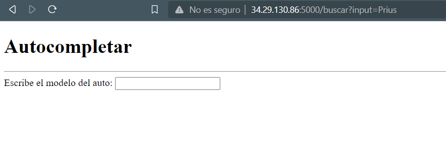

# Clase 01 - Semana 12
## Bases de datos avanzadas

Ingresamos a nuestro directorio de *Proyectos*

> Una distribución de Sistema Operativo se refiere al tipo y versión, en este caso se utiliza CentOS Stream 9 y proviene de la distribución Red Hat

```bash
cd Proyectos
```

Ingresamos al ejemplo 09
```shell
cd ejemplo09
```

Ingresaremos al archivo de vista.py
```shell
vi vista.py
```

Verificaremos lo realizado

Ahora se ingresará a productos.html
```shell
vi templates/productos.html
```

Ahí desarrollaremos lo siguiente
```html
<!DOCTYPE html>
<html>
 <head>
   <title>Productos</title>
 </head>
<body>
 <h3>Productos Seleccionados</h3>
 <hr>
 <ul>
   
   <li>{{ producto[1] }},&nbsp;{{ producto[2] }},&nbsp;{{ producto[3] }}</li>
   
 </ul>
</body>
</html>
```

En el caso deseemos inicializarlo de una mejor forma podemos usar los .sh de Linux

```shell
vi arranca.sh
```
Desarrollamos en lo siguiente
```sh
#!/usr/bin/bash
export FLASK_APP=vista.py
flask run --host=0.0.0.0
```

Les cambiamos los permisos que posee
```shell
chmod 755 arranca.sh
```

Se vio un error al momento de ingresar el Selecciona.
De este modo, se deberá de verificar en el template de selecciona.

```shell
vi selecciona.html
```

Verificamos la forma de enviar los datos necesarios, así que revisamos en la vista.py
```shell
vi vista.py
```
Corregimos de la siguiente manera
```py
@app.route('/productos/')
def productos():
    id = request.args.get("categoria")
    cursor = mysql.connection.cursor()
    cursor.execute("SELECT * FROM Productos WHERE categoria_id = %s ", [id])
    productos = cursor.fetchall()
    cursor.close()
    return render_template('productos.html', productos=productos)
```


Ahora realizaremos el autocomplete
```py
@app.route('/buscar')
def buscar():
    return render_template('buscar.html')

@app.route('/autocomplete', methods=['POST'])
def autocomplete():
    input = request.form['input']
    cursor = mysql.connection.cursor()
    cursor.execute("SELECT Nombre FROM Productos WHERE Nombre LIKE %s",('%'+input+'%',))
    resultado = cursor.fetchall()
    cursor.close()
    return render_template("autocomplete.html", resultado=resultado)
```

Desarrollamos un archivo HTML
```shell
vi templates/buscar.html
```

Realizaremos lo siguiente
```html
<!DOCTYPE html>
<html>
  <head>
   <title>Buscar</title>
   <script src="https://code.jquery.com/jquery-3.6.0.min.js"></script>
   <script src="{{ url_for('static',filename='autocompleta.js') }}"></script>
   
  </head>
<body>

  <h1>Autocompletar</h1>
  <form>
   <label>Introduce el modelo de auto </label>
   <input type="text" id="input" name="input">
  </form>
  <div id="resultado">
  </div>
</body>
</html>
```



