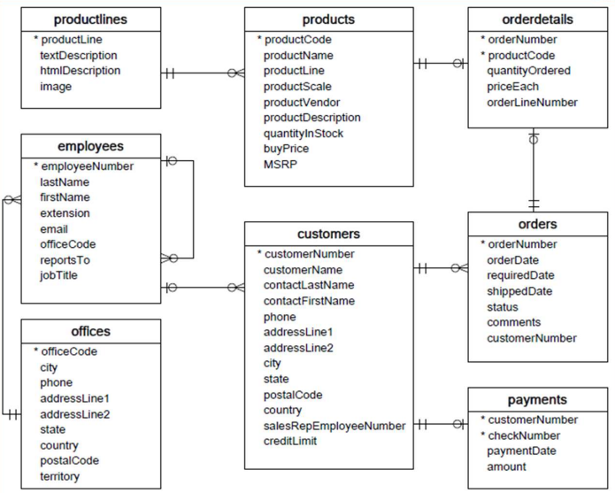

## Ejercicios 

## Conceptualización
### Diagrama de la base de datos 



### Notación de relaciones


- - -
## Restauración Base de Datos

Crear la base de datos correspondiente
```sql
CREATE DATABASE LoteAutos;
```
Crear el usuario correspondiente
```sql
GRANT ALL PRIVILEGES ON LoteAutos.* TO autos_user@localhost IDENTIFIED BY '666';

FLUSH PRIVILEGES;
```

Realizar el backup del Schema de la Base de datos
```shell
mysql --user=autos_user --password LoteAutos < AutosClasicos-Schema.sql
```

Realizar el backup de los datos
```shell
mysql --user=autos_user --password LoteAutos < AutosClasicos.sql
```
Ingresar como el usuario
```shell
mysql -u autos_user -p LoteAutos
```
Verificar las tablas
```sql
SHOW TABLES;
```
Verificar los campos de la tabla
```sql
DESCRIBE products;
```
Crear un Stored Procedure para ver los productos
```sql
DELIMITER //
CREATE PROCEDURE obtieneTodosLosProductos()
 BEGIN
  SELECT * FROM Products;
 END //
 DELIMITER ;
```
Eliminar el procedimiento
```sql
DROP PROCEDURE obtieneTodosLosProductos;
```

Stored Procedure para nombre de producto y linea del producto
```sql
DELIMITER //
CREATE PROCEDURE obtieneTodosLosProductos()
BEGIN
 SELECT productName, productLine, productDescription FROM products;
END //
DELIMITER ;
```
Stored Procedure para obtener Cliente
```sql
DELIMITER //
CREATE PROCEDURE obtieneClientes()
BEGIN
 SELECT customerName FROM customers; 
END //
DELIMITER;
```


Stored Procedure Obtener a los empleados y su estado según oficina
```sql
DELIMITER $$
CREATE PROCEDURE obtenerEmpleados()
BEGIN
  SELECT
    firstName,
    lastname,
    city,
    state,
    country
  FROM employees
  INNER JOIN offices USING (officeCode);
END $$
DELIMITER ;
```

--- 
### Uso de IN OUT INOUT
Crear Stored Procedure que encuentre las oficinas que se ubican según el país especificado

```sql
DELIMITER $$
CREATE PROCEDURE obtenerOficinaPorPais(
 IN countryName VARCHAR(255)
)
BEGIN
  SELECT *
  FROM offices
  WHERE country = countryName;
END $$
DELIMITER ;
```
