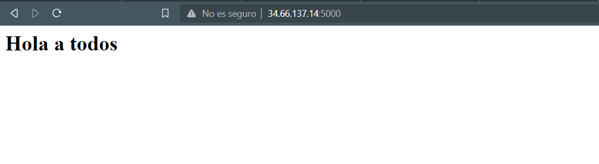
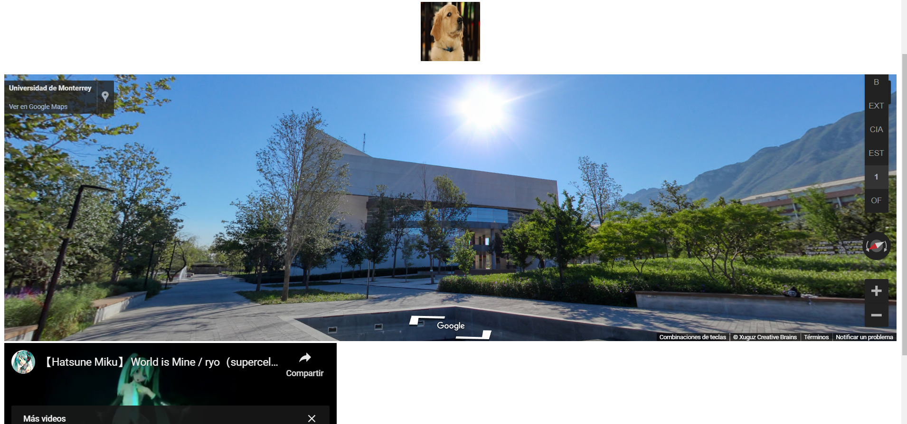

# Clase 01 - Semana 08
## Bases de datos avanzadas

#### Ingresar a la máquina virtual a través del GCP

En el caso se deseen guardar los comandos se debe de realizar
```shell
history > comandos.txt
```
Esto permitirá guardarlo y luego descargarlo en nuestra máquina local.

> Esto puede servir para verificar y mantener los comandos

### Crear una regla de firewall
Se debe de habilitar una regla para permitir el tráfico en el puerto 5000 
- - -

Ingresamos al directorio Proyectos
```shell
 cd Proyectos/
```

Ingresamos al directorio ejemplo01
```shell
 cd ejemplo01/
```

Abrimos el archivo que habíamos creado
```shell
 vi app.py
```

Hasta el momento se tiene lo siguiente

```py
from flask import Flask

app = Flask(__name__)

@app.route("/")
def prueba():
    return '<h1>Hola a todos</h1>'                                
```

> Salimos escape :wq

Para poder inicializar la aplicación Flask

```shell
export FLASK_APP = app.py
```
> Se genera la variable FLASK_APP para que pueda utilizarlo flask

Ejecutar flask
```
flask run --host=0.0.0.0
```
> El *--host=0.0.0.0* permite que se pueda consultar al puerto 5000 desde todas las direcciones disponibles de la máquina virtual

Con ello, se puede visualizar lo siguiente



- - -

## Modificando el retorno

Copiaremos el contenido de la carpeta ejemplo01 a ejemplo02

```shell
cp -fR ejemplo01 ejemplo02
```

> el *-fR* permite realizar el copiado forzado y recursivo de todos los elementos del directorio.

> *cd* siempre regresa al directorio de trabajo

Ingresamos al ejemplo 02
```shell
cd ejemplo02
```

Verificamos que estén todos los archivos
```shell
ls -l
```

Ingresamos al archivo
```shell
vi app.py
```
Modificar utilizando la etiqueta **\<font color>**
```py
from flask import Flask

app = Flask(__name__)

@app.route("/")
def prueba():
    return '<font color="red"><h1>Hola a todos</h1></font>'
```
Verificamos el resultado ejecutando nuevamente
```flask
flask run --host=0.0.0.0
```

## Estructura de una aplicación Flask

Volvemos a Proyectos
```
cd Proyectos
```

Creamos el directorio ejemplo03
```
mkdir ejemplo03
```

Copiamos el archivo app.py de ejemplo02 en ejemplo03
```shell
cp ejemplo02/app.py ejemplo03
```

Ingresamos al directorio ejemplo03
```shell
cd ejemplo03
```

Es mandatorio que todas las aplicaciones Flask se mantengan según el orden
* Templates
```shell
mkdir templates
```
* Static
```shell
mkdir static
```
Estructura
```shell
.
├── app.py
├── static # Archivos estáticos js, css, imgs
└── templates # Archivos .html que serán renderizados
```
> Para conocer la estructura en formato arbol, se puede instalar tree a través de *sudo dnf install tree -y*

- - -
Para obtener contenido desde internet sin requerir un navegador
```shell
sudo dnf install wget -y
```
- - -

Nos posicionaremos en el directorio templates
```shell
cd templates
```
Obtendremos el archivo
```shell
wget https://www.w3schools.com/w3css/tryw3css_templates_band.htm
```
> Se utiliza un template de w3schools por practicidad

Debemos de renombrar el archivo 
```
mv tryw3css_templates_band.htm pagina.html
```

> Se recomienda seguir tutoriales de [w3schools](https://www.w3schools.com/)

Ahora regresaremos al archivo app.py

```shell
cd ..
```

Ingresar al app.py
```
vi app.py
```

Importar render_template y utilizarlo con la página recientemente descargada
```py
from flask import Flask, render_template

app = Flask(__name__)

@app.route("/")
def prueba():
    return render_template('pagina.html')
```

Removemos el archivo 
```shell
rm templates/pagina.html
```

Crearemos un nuevo archivo
```shell
vi templates/pagina.html
```

En este archivo colocaremos lo siguiente
```html
<!DOCTYPE html>
 <html>
  <head>
    <title>Mi primer vista web</title>
  </head>
 <body>
  <h1>Esto es un p&aacute;rrafo</h1>
  <p>As&iacute; se escribe un acento, ni&ntilde;o</p>
 </body>
</html>
```

Añadiremos una imagen al documento
```html
<!DOCTYPE html>
 <html>
  <head>
    <title>Mi primer vista web</title>
  </head>
 <body>
  <h1>Esto es un p&aacute;rrafo</h1>
  <p>As&iacute; se escribe un acento, ni&ntilde;o</p>
  <br>
  <br> <br><center>  </center>
  <br>

 </body>
</html>
```

Ahora integraremos un mapa
```html
<!DOCTYPE html>
 <html>
  <head>
    <title>Mi primer vista web</title>
  </head>
 <body>
  <h1>Esto es un p&aacute;rrafo</h1>
  <p>As&iacute; se escribe un acento, ni&ntilde;o</p>
  <br>
  <br><center>
  </center>
  <br>
  <iframe src="https://www.google.com/maps/embed?pb=!4v1695051750798!6m8!1m7!1sCAoSLEFGMVFpcE54UDA3M24wZ1J0ZFE1blZFSWYxbGZPa2NlNlFzelg2azFBUWVR!2m2!1d25.662934810628!2d-100.42075806154!3f76.02717154717143!4f-15.205679581647686!5f0.7820865974627469" width="100%" height="450" style="border:0;" allowfullscreen="" loading="lazy" referrerpolicy="no-referrer-when-downgrade"></iframe>
 </body>
</html>
```

Ahora incorporando un video
```html
<!DOCTYPE html>
 <html>
  <head>
    <title>Mi primer vista web</title>
  </head>
 <body>
  <h1>Esto es un p&aacute;rrafo</h1>
  <p>As&iacute; se escribe un acento, ni&ntilde;o</p>
  <br>
  <br><center>
  </center>
  <br>
  <iframe src="https://www.google.com/maps/embed?pb=!4v1695051750798!6m8!1m7!1sCAoSLEFGMVFpcE54UDA3M24wZ1J0ZFE1blZFSWYxbGZPa2NlNlFzelg2azFBUWVR!2m2!1d25.662934810628!2d-100.42075806154!3f76.02717154717143!4f-15.205679581647686!5f0.7820865974627469" width="100%" height="450" style="border:0;" allowfullscreen="" loading="lazy" referrerpolicy="no-referrer-when-downgrade"></iframe>
  <br>
  <iframe width="560" height="315" src="https://www.youtube.com/embed/jhl5afLEKdo?si=HlX4fN2dQKWiowdJ" title="YouTube video player" frameborder="0" allow="accelerometer; autoplay; clipboard-write; encrypted-media; gyroscope; picture-in-picture; web-share" allowfullscreen></iframe>
 </body>
</html>
```
Como resultado final, se tiene


