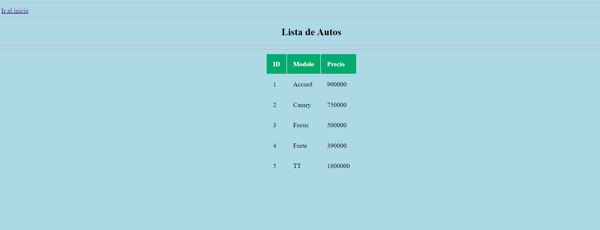

# Clase 01 - Semana 09
## Bases de datos avanzadas

*SaaS*: **Software as a Service** Es el core de la nube, siempre nuestro software que desarrollemos, si está en la nube. Las empresas venden el software por licencia. De este modo, se venden licencias por usuario, al tener un usuario y contraseña ya tienen el software.

*PaaS*: **Platform as a Service** Te brinda toda la plataforma que permite el desarrollo. La nube provee todos los recursos donde se puedan configurar, instalar, recrear lo necesario sin la necesidad de una computadora personal.

*IaaS*: **Infraestructure as a Service** Proveer la capacidad de hardware y mecánismo de comunicación, tales como redes, intranet, VPN, firewall, computadora, procesador, memoria, etc. De este modo, ya no es necesario todos los recursos físicos de un centro de datos comúnmente.

- - -

Ingresamos a la base de datos **Agencia**


```shell
mysql -u agencia_user -p Agencia
```
Verificamos las tablas
```mysql
SHOW TABLES;
```

Asimismo, ingresamos al directorio Proyectos
```shell
cd Proyectos
```

Nos dirigimos al directorio ejemplo05
```shell
cd ejemplo05
```

Ingresamos a un archivo vista.py
```shell
vi vista.py
```

Dentro del archivo
```py
from flask import Flask, render_template
## Importamos la librería flask_mysqldb
# Con ello pemrmitirá conectar con la DB
from flask_mysqldb import MySQL

app = Flask(__name__)
mysql = MySQL(app)

###
# Datos de acceso a la Base de Datos
app.config['MYSQL_HOST']='localhost'
app.config['MYSQL_USER']='agencia_user'
app.config['MYSQL_PASSWORD']='666'
app.config['MYSQL_DB']='Agencia'

print("Conexión exitosa")

## Creando ruta

@app.route('/', methods=['GET'])
def inicio():
    return render_template('index.html')

if __name__ == '__main__':
    app.run(debug=True)
```

Crearemos el documento *index.html*

```shell
cd templates
```
Copiamos el archivo pagina.html
```shell
cp pagina.html index.html
```
Modificamos el index.html
```shell
vi index.html
```
En el index.html añadimos lo siguiente
```html
<!DOCTYPE html>
 <html>
  <head>
    <meta charset="UTF-8">
    <meta content="width=device-width, initial-scale=1, maximum-scale=1, user-scalable=no">
    <link rel="stylesheet" href="{{ url_for('static', filename='css/estilo.css') }}">
    <title>Muestra Datos de la Base de Datos</title>
  </head>
 <body>
 <!-- Cuerpo del documento  -->

 <h1> ESTE ES EL DOCUMENTO INICIAL -- LLAMADO LANDING PAGE </h1>


 <!-- Fin del cuerpo del documento -->
 </body>
</html>
```
Creamos la variable *FLASK_APP*
```shell
export FLASK_APP=vista.py
```
Ejecutamos la aplicación de Flask
```shell
flask run --host=0.0.0.0
```

En la página web se mostrará de la siguiente manera


- - -
### Utilizando la Base de Datos
Modificaremos el archivo *vista.py*
```py
from flask import Flask, render_template
## Importamos la librería flask_mysqldb
# Con ello pemrmitirá conectar con la DB
from flask_mysqldb import MySQL

app = Flask(__name__)
mysql = MySQL(app)

###
# Datos de acceso a la Base de Datos
app.config['MYSQL_HOST']='localhost'
app.config['MYSQL_USER']='agencia_user'
app.config['MYSQL_PASSWORD']='666'
app.config['MYSQL_DB']='Agencia'

print("Conexión exitosa")

## Creando ruta

## Mostrar Landing
@app.route('/')
def inicio():
    return render_template('pagina.html')

## Acceder a la base de datos y mostrar registros
@app.route('/ver', methods=['GET'])
def ver_datos():
    cursor = mysql.connection.cursor()
    # Ejecutamos la sentencia SQL para obtener todo
    cursor.execute('''SELECT id,Modelo,Precio FROM Autos''')
    # Almacenamos todo lo necesario en nuestra variable Autos, a través del método fetchall()
    Autos = cursor.fetchall()
    
    # Enviaremos los datos hacia el pagina.html donde Jinja2 los recepcionará
    return render_template('pagina.html', Autos=Autos)

if __name__ == '__main__':
    app.run(debug=True)
```

Ingresamos a nuestra pagina.html
```shell
vi templates/pagina.html
```

Modificamos el archivo de la siguiente manera
```jinja
<!DOCTYPE html>
 <html>
  <head>
    <meta charset="UTF-8">
    <meta content="width=device-width, initial-scale=1, maximum-scale=1, user-scalable=no">
    <link rel="stylesheet" href="{{ url_for('static', filename='css/estilo.css') }}">
    <title>Muestra Datos de la Base de Datos</title>
  </head>
 <body>
 <!-- Cuerpo del documento  -->
 <center>
  <h2>Lista de Autos</h2>
  <hr><hr>
  <table>
  <!-- Definicion de encabezado y columnas -->
   <thead>
    <tr>
     <th>ID</th>
     <th>Modelo</th>
     <th>Precio</th>
    </tr>
   </thead>
  <!-- Definicion del cuerpo de la tabla con dato manipulados con Jinja -->
   <tbody>
      
      <tr>
        <td> {{ auto[0] }} </td>
        <td> {{ auto[1] }} </td>
        <td> {{ auto[2] }} </td>
      </tr>
       
   </tbody>
  </table>
 <!-- Fin del cuerpo del documento -->
 </body>
</html>
```

Para mejorar el formato de presentación
```shell
vi static/css/estilo.css
```

Modificamos el archivo css
```css
body {
  background-color: lightblue;
}

h1 {
  color: white;
  text-align: center;
}

p {
  font-family: verdana;
  font-size: 20px;
}

tr:hover{
 background-color: coral;
}

th {
 background-color: #04AA6D;
 color: white;
}

th,td {
 padding: 15px;
 text-align: left;
}
```

Agregaremos un método para poder ingresar desde el index.html hacia el pagina.html

```html
 <hr>
  <!-- Crea una liga o referencia a otro documento-->
  <a href="/ver"> Ver datos </a>
 <hr>
```

De este modo, el archivo estará de la siguiente manera

```html
<!DOCTYPE html>
 <html>
  <head>
    <meta charset="UTF-8">
    <meta content="width=device-width, initial-scale=1, maximum-scale=1, user-scalable=no">
    <link rel="stylesheet" href="{{ url_for('static', filename='css/estilo.css') }}">
    <title>Muestra Datos de la Base de Datos</title>
  </head>
 <body>
 <!-- Cuerpo del documento  -->
 <hr>
  <!-- Crea una liga o referencia a otro documento-->
  <a href="/ver"> Ver datos </a>
 <hr>
 <h1> ESTE ES EL DOCUMENTO INICIAL -- LLAMADO LANDING PAGE </h1>


 <!-- Fin del cuerpo del documento -->
 </body>
</html>
```

Igualmente en pagina.html, le agregaremos
```html
 <hr>
  <a href="/"> Ir al inicio </a>
 <hr>
```

Con ello, el archivo estará de la siguiente manera
```html
<!DOCTYPE html>
 <html>
  <head>
    <meta charset="UTF-8">
    <meta content="width=device-width, initial-scale=1, maximum-scale=1, user-scalable=no">
    <link rel="stylesheet" href="{{ url_for('static', filename='css/estilo.css') }}">
    <title>Muestra Datos de la Base de Datos</title>
  </head>
 <body>
 <hr>
  <a href="/"> Ir al inicio </a>
 <hr>
 <!-- Cuerpo del documento  -->
 <center>
  <h2>Lista de Autos</h2>
  <hr><hr>
  <table>
  <!-- Definicion de encabezado y columnas -->
   <thead>
    <tr>
     <th>ID</th>
     <th>Modelo</th>
     <th>Precio</th>
    </tr>
   </thead>
  <!-- Definicion del cuerpo de la tabla con dato manipulados con Jinja -->
   <tbody>
      
      <tr>
        <td> {{ auto[0] }} </td>
        <td> {{ auto[1] }} </td>
        <td> {{ auto[2] }} </td>
      </tr>
      
   </tbody>
  </table>
 <!-- Fin del cuerpo del documento -->
 </body>
</html>
```

 - - -

### Comprobando el dinamismo

En la base de datos **Agencia** ingresaremos el siguiente dato

```sql
INSERT INTO Autos (Nombre, Modelo, Anio, Precio) VALUES ('Audi','TT',2023,1800000);
```

Ahora aparecerá automáticamente el nuevo dato
