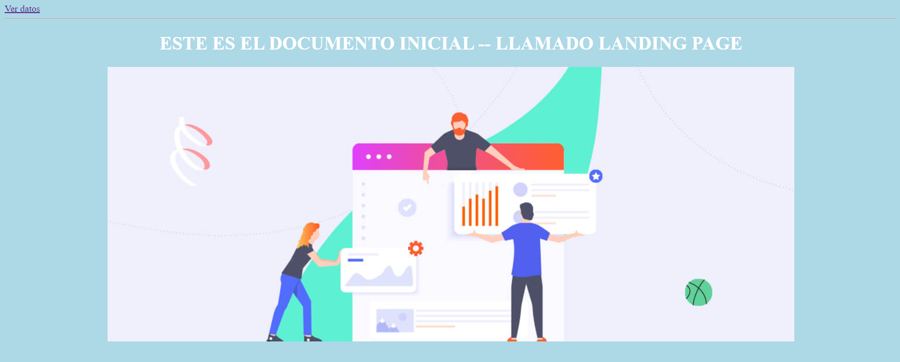
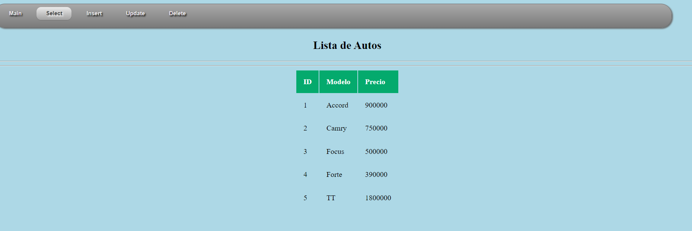

# Clase 02 - Semana 09
## Bases de datos avanzadas


### Recordatorio

Elementos de Formularios

```bash
textfield
radio button -> Seleccionar solo uno de las opciones
check boxes -> Seleccionar todos o ninguno
dropdown menu -> Una lista desplegable de las opciones
text boxes -> Para llenado de texto amplio 
```

Cada uno de los elementos deben de ser "bautizados" a través de un nombre. Por ejemplo, *nombre*, al momento del usuario subir el formulario. Flask utilizará el parametro para identificar cada uno de los elementos.

---
### Continuando en Flask

Realizamos una copia del directorio *ejemplo05*
```shell
cp -fR ejemplo05 ejemplo06
```

Ingresamos al directorio ejemplo06
```shell
cp ejemplo06
```
- - -
En otra terminal, ingresamos hacia la base de datos
```shell
mysql -u agencia_user -p Agencia
```

Verificamos las tablas
```sql
SHOW TABLES;
```

Verificamos la descripción y atributos de la tabla **Autos**
```sql
DESC Autos;
```
-  - -

Nos posicionamos en el directorio de imagenes en static
```shell
cd static/images
```

Para obtener una imagen, requerimos de instalar **wget** en caso no se posea
```shell
sudo dnf install wget -y
```

Utilizamos el comando
```
wget https://email.uplers.com/blog/wp-content/uploads/2022/01/Ways-to-drive-traffic-to-your-landing-page.jpg
```

Verificamos que se encuentre instalado la imagen
```
ls -l
```

Renombraremos el archivo
```
mv Ways-to-drive-traffic-to-your-landing-page.jpg image.jpg
```

Subimos hacia la ruta de ejemplo06 e ingresamos hacia templates
```
cd ../../templates/
```
Recordando la estructura de nuestras carpetas
```shell
. # Llegamos acá con el segundo ..
│ 
├── static # Subimos una escala ..
│   ├── css 
│   │   └── estilo.css
│   └── images # Acá estabamos
│       └── image.jpg 
├── templates # E ingresamos acá
│   ├── index.html
│   └── pagina.html
└── vista.py
```

En el archivo de pagina.html, realizamos lo siguiente
```html
<!DOCTYPE html>
 <html>
  <head>
    <meta charset="UTF-8">
    <meta content="width=device-width, initial-scale=1, maximum-scale=1, user-scalable=no">
    <link rel="stylesheet" href="{{ url_for('static', filename='css/estilo.css') }}">
    <title>Muestra Datos de la Base de Datos</title>
  </head>
 <body>
 <!-- Cuerpo del documento  -->
 <hr>
  <!-- Crea una liga o referencia a otro documento -->
  <a href="/ver"> Ver datos </a>
 <hr>
 <h1> ESTE ES EL DOCUMENTO INICIAL -- LLAMADO LANDING PAGE </h1>
 <center>
  </img>
 </center>
 <!-- Fin del cuerpo del documento -->
 </body>
</html>
```

Ejecutamos Flask
```shell
export FLASK_APP=vista.py
flask run --host=0.0.0.0
```

Se mostrará la imagen en la página del Landing Page



Ahora, modificaremos el tamaño de la imagen
```html
  </img>
```

De este modo, el archivo quedará así:
```html
<!DOCTYPE html>
 <html>
  <head>
    <meta charset="UTF-8">
    <meta content="width=device-width, initial-scale=1, maximum-scale=1, user-scalable=no">
    <link rel="stylesheet" href="{{ url_for('static', filename='css/estilo.css') }}">
    <title>Muestra Datos de la Base de Datos</title>
  </head>
 <body>
 <!-- Cuerpo del documento  -->
 <hr>
  <!-- Crea una liga o referencia a otro documento -->
  <a href="/ver"> Ver datos </a>
 <hr>
 <h1> ESTE ES EL DOCUMENTO INICIAL -- LLAMADO LANDING PAGE </h1>
 <center>
  </img>
 </center>
 <!-- Fin del cuerpo del documento -->
 </body>
</html>
```

### Añadiendo un menú y estilos

Ingresamos hacia el archivo de estilos
```shell
cd static/css
```

Ingresamos hacia el archivo

```shell
vi estilo.css
```

En el archivo agregaremos el codigo
```css
#menu-bar {
  width: 95%;
  margin: 0px 0px 0px 0px;
  padding: 6px 6px 4px 6px;
  height: 40px;
  line-height: 100%;
  border-radius: 24px;
  -webkit-border-radius: 24px;
  -moz-border-radius: 24px;
  box-shadow: 2px 2px 3px #666666;
  -webkit-box-shadow: 2px 2px 3px #666666;
  -moz-box-shadow: 2px 2px 3px #666666;
  background: #8B8B8B;
  background: linear-gradient(top,  #A9A9A9,  #7A7A7A);
  background: -ms-linear-gradient(top,  #A9A9A9,  #7A7A7A);
  background: -webkit-gradient(linear, left top, left bottom, from(#A9A9A9), to(#7A7A7A));
  background: -moz-linear-gradient(top,  #A9A9A9,  #7A7A7A);
  border: solid 1px #6D6D6D;
  position:relative;
  z-index:999;
}
#menu-bar li {
  margin: 0px 0px 6px 0px;
  padding: 0px 6px 0px 6px;
  float: left;
  position: relative;
  list-style: none;
}
#menu-bar a {
  font-weight: bold;
  font-family: arial;
  font-style: normal;
  font-size: 12px;
  color: #E7E5E5;
  text-decoration: none;
  display: block;
  padding: 6px 20px 6px 20px;
  margin: 0;
  margin-bottom: 6px;
  border-radius: 10px;
  -webkit-border-radius: 10px;
  -moz-border-radius: 10px;
  text-shadow: 2px 2px 3px #000000;
}
#menu-bar li ul li a {
  margin: 0;
}
#menu-bar .active a, #menu-bar li:hover > a {
  background: #0399D4;
  background: linear-gradient(top,  #EBEBEB,  #A1A1A1);
  background: -ms-linear-gradient(top,  #EBEBEB,  #A1A1A1);
  background: -webkit-gradient(linear, left top, left bottom, from(#EBEBEB), to(#A1A1A1));
  background: -moz-linear-gradient(top,  #EBEBEB,  #A1A1A1);
  color: #444444;
  -webkit-box-shadow: 0 1px 1px rgba(0, 0, 0, .2);
  -moz-box-shadow: 0 1px 1px rgba(0, 0, 0, .2);
  box-shadow: 0 1px 1px rgba(0, 0, 0, .2);
  text-shadow: 2px 2px 3px #FFFFFF;
}
#menu-bar ul li:hover a, #menu-bar li:hover li a {
  background: none;
  border: none;
  color: #666;
  -box-shadow: none;
  -webkit-box-shadow: none;
  -moz-box-shadow: none;
}
#menu-bar ul a:hover {
  background: #0399D4 !important;
  background: linear-gradient(top,  #04ACEC,  #0186BA) !important;
  background: -ms-linear-gradient(top,  #04ACEC,  #0186BA) !important;
  background: -webkit-gradient(linear, left top, left bottom, from(#04ACEC), to(#0186BA)) !important;
  background: -moz-linear-gradient(top,  #04ACEC,  #0186BA) !important;
  color: #FFFFFF !important;
  border-radius: 0;
  -webkit-border-radius: 0;
  -moz-border-radius: 0;
  text-shadow: 2px 2px 3px #FFFFFF;
}
#menu-bar li:hover > ul {
  display: block;
}
#menu-bar ul {
  background: #DDDDDD;
  background: linear-gradient(top,  #FFFFFF,  #CFCFCF);
  background: -ms-linear-gradient(top,  #FFFFFF,  #CFCFCF);
  background: -webkit-gradient(linear, left top, left bottom, from(#FFFFFF), to(#CFCFCF));
  background: -moz-linear-gradient(top,  #FFFFFF,  #CFCFCF);
  display: none;
  margin: 0;
  padding: 0;
  width: 185px;
  position: absolute;
  top: 30px;
  left: 0;
  border: solid 1px #B4B4B4;
  border-radius: 10px;
  -webkit-border-radius: 10px;
  -moz-border-radius: 10px;
  -webkit-box-shadow: 2px 2px 3px #222222;
  -moz-box-shadow: 2px 2px 3px #222222;
  box-shadow: 2px 2px 3px #222222;
}
#menu-bar ul li {
  float: none;
  margin: 0;
  padding: 0;
}
#menu-bar ul a {
  padding:10px 0px 10px 15px;
  color:#424242 !important;
  font-size:12px;
  font-style:normal;
  font-family:arial;
  font-weight: normal;
  text-shadow: 2px 2px 3px #FFFFFF;
}
#menu-bar ul li:first-child > a {
  border-top-left-radius: 10px;
  -webkit-border-top-left-radius: 10px;
  -moz-border-radius-topleft: 10px;
  border-top-right-radius: 10px;
  -webkit-border-top-right-radius: 10px;
  -moz-border-radius-topright: 10px;
}
#menu-bar ul li:last-child > a {
  border-bottom-left-radius: 10px;
  -webkit-border-bottom-left-radius: 10px;
  -moz-border-radius-bottomleft: 10px;
  border-bottom-right-radius: 10px;
  -webkit-border-bottom-right-radius: 10px;
  -moz-border-radius-bottomright: 10px;
}
#menu-bar:after {
  content: ".";
  display: block;
  clear: both;
  visibility: hidden;
  line-height: 0;
  height: 0;
}
#menu-bar {
  display: inline-block;
}
  html[xmlns] #menu-bar {
  display: block;
}
* html #menu-bar {
  height: 1%;
}
```

Con ello, el archivo quedará así

```css
body {
  background-color: lightblue;
}

h1 {
  color: white;
  text-align: center;
}

p {
  font-family: verdana;
  font-size: 20px;
}

tr:hover{
 background-color: coral;
}

th {
 background-color: #04AA6D;
 color: white;
}

th,td {
 padding: 15px;
 text-align: left;
}
#menu-bar {
  width: 95%;
  margin: 0px 0px 0px 0px;
  padding: 6px 6px 4px 6px;
  height: 40px;
  line-height: 100%;
  border-radius: 24px;
  -webkit-border-radius: 24px;
  -moz-border-radius: 24px;
  box-shadow: 2px 2px 3px #666666;
  -webkit-box-shadow: 2px 2px 3px #666666;
  -moz-box-shadow: 2px 2px 3px #666666;
  background: #8B8B8B;
  background: linear-gradient(top,  #A9A9A9,  #7A7A7A);
  background: -ms-linear-gradient(top,  #A9A9A9,  #7A7A7A);
  background: -webkit-gradient(linear, left top, left bottom, from(#A9A9A9), to(#7A7A7A));
  background: -moz-linear-gradient(top,  #A9A9A9,  #7A7A7A);
  border: solid 1px #6D6D6D;
  position:relative;
  z-index:999;
}
#menu-bar li {
  margin: 0px 0px 6px 0px;
  padding: 0px 6px 0px 6px;
  float: left;
  position: relative;
  list-style: none;
}
#menu-bar a {
  font-weight: bold;
  font-family: arial;
  font-style: normal;
  font-size: 12px;
  color: #E7E5E5;
  text-decoration: none;
  display: block;
  padding: 6px 20px 6px 20px;
  margin: 0;
  margin-bottom: 6px;
  border-radius: 10px;
  -webkit-border-radius: 10px;
  -moz-border-radius: 10px;
  text-shadow: 2px 2px 3px #000000;
}
#menu-bar li ul li a {
  margin: 0;
}
#menu-bar .active a, #menu-bar li:hover > a {
  background: #0399D4;
  background: linear-gradient(top,  #EBEBEB,  #A1A1A1);
  background: -ms-linear-gradient(top,  #EBEBEB,  #A1A1A1);
  background: -webkit-gradient(linear, left top, left bottom, from(#EBEBEB), to(#A1A1A1));
  background: -moz-linear-gradient(top,  #EBEBEB,  #A1A1A1);
  color: #444444;
  -webkit-box-shadow: 0 1px 1px rgba(0, 0, 0, .2);
  -moz-box-shadow: 0 1px 1px rgba(0, 0, 0, .2);
  box-shadow: 0 1px 1px rgba(0, 0, 0, .2);
  text-shadow: 2px 2px 3px #FFFFFF;
}
#menu-bar ul li:hover a, #menu-bar li:hover li a {
  background: none;
  border: none;
  color: #666;
  -box-shadow: none;
  -webkit-box-shadow: none;
  -moz-box-shadow: none;
}
#menu-bar ul a:hover {
  background: #0399D4 !important;
  background: linear-gradient(top,  #04ACEC,  #0186BA) !important;
  background: -ms-linear-gradient(top,  #04ACEC,  #0186BA) !important;
  background: -webkit-gradient(linear, left top, left bottom, from(#04ACEC), to(#0186BA)) !important;
  background: -moz-linear-gradient(top,  #04ACEC,  #0186BA) !important;
  color: #FFFFFF !important;
  border-radius: 0;
  -webkit-border-radius: 0;
  -moz-border-radius: 0;
  text-shadow: 2px 2px 3px #FFFFFF;
}
#menu-bar li:hover > ul {
  display: block;
}
#menu-bar ul {
  background: #DDDDDD;
  background: linear-gradient(top,  #FFFFFF,  #CFCFCF);
  background: -ms-linear-gradient(top,  #FFFFFF,  #CFCFCF);
  background: -webkit-gradient(linear, left top, left bottom, from(#FFFFFF), to(#CFCFCF));
  background: -moz-linear-gradient(top,  #FFFFFF,  #CFCFCF);
  display: none;
  margin: 0;
  padding: 0;
  width: 185px;
  position: absolute;
  top: 30px;
  left: 0;
  border: solid 1px #B4B4B4;
  border-radius: 10px;
  -webkit-border-radius: 10px;
  -moz-border-radius: 10px;
  -webkit-box-shadow: 2px 2px 3px #222222;
  -moz-box-shadow: 2px 2px 3px #222222;
  box-shadow: 2px 2px 3px #222222;
}
#menu-bar ul li {
  float: none;
  margin: 0;
  padding: 0;
}
#menu-bar ul a {
  padding:10px 0px 10px 15px;
  color:#424242 !important;
  font-size:12px;
  font-style:normal;
  font-family:arial;
  font-weight: normal;
  text-shadow: 2px 2px 3px #FFFFFF;
}
#menu-bar ul li:first-child > a {
  border-top-left-radius: 10px;
  -webkit-border-top-left-radius: 10px;
  -moz-border-radius-topleft: 10px;
  border-top-right-radius: 10px;
  -webkit-border-top-right-radius: 10px;
  -moz-border-radius-topright: 10px;
}
#menu-bar ul li:last-child > a {
  border-bottom-left-radius: 10px;
  -webkit-border-bottom-left-radius: 10px;
  -moz-border-radius-bottomleft: 10px;
  border-bottom-right-radius: 10px;
  -webkit-border-bottom-right-radius: 10px;
  -moz-border-radius-bottomright: 10px;
}
#menu-bar:after {
  content: ".";
  display: block;
  clear: both;
  visibility: hidden;
  line-height: 0;
  height: 0;
}
#menu-bar {
  display: inline-block;
}
  html[xmlns] #menu-bar {
  display: block;
}
* html #menu-bar {
  height: 1%;
}
```

Retomamos a la ruta de ejemplo06
```shell
cd ../..
```

Regresamos hacia el archivo index.html
```shell
vi templates/index.html
```

Copiaremos e introduciremos el código que generamos de Menú. Con ello, quedará así:
```html
<!DOCTYPE html>
 <html>
  <head>
    <meta charset="UTF-8">
    <meta content="width=device-width, initial-scale=1, maximum-scale=1, user-scalable=no">
    <link rel="stylesheet" href="{{ url_for('static', filename='css/estilo.css') }}">
    <title>Muestra Datos de la Base de Datos</title>
  </head>
 <body>
 <!-- Cuerpo del documento  -->
 <hr>
  <!-- Crea una liga o referencia a otro documento -->
    <ul id="menu-bar">
        <li class="active"><a href="#"><span id="active">Main</span></a></li>
        <li><a href="/ver">Select</a>
        </li>
        <li><a href="#">Insert</a>
        </li>
        <li><a href="#">Update</a></li>
        <li><a href="#">Delete</a></li>
    </ul>
  <!-- Crea una liga o referencia a otro documento -->
 <hr>
 <h1> ESTE ES EL DOCUMENTO INICIAL -- LLAMADO LANDING PAGE </h1>
 <center>
  </img>
 </center>
 <!-- Fin del cuerpo del documento -->
 </body>
</html>
```

Ahora replicaremos la estructura del menú en el archivo de templates pagina.html
```shell
vi pagina.html
```

De este modo, el archivo queda de la siguiente manera
```html
<!DOCTYPE html>
 <html>
  <head>
    <meta charset="UTF-8">
    <meta content="width=device-width, initial-scale=1, maximum-scale=1, user-scalable=no">
    <link rel="stylesheet" href="{{ url_for('static', filename='css/estilo.css') }}">
    <title>Muestra Datos de la Base de Datos</title>
  </head>
 <body>
 <!-- Cuerpo del documento  -->
 <!-- Creando liga a documentos -->
    <ul id="menu-bar">
        <li><a href="/"><span id="active">Main</span></a></li>
        <li class="active"><a href="#"><span id="active">Select</span></a>
        </li>
        <li><a href="#">Insert</a>
        </li>
        <li><a href="#">Update</a></li>
        <li><a href="#">Delete</a></li>
    </ul>
  <!-- Creando liga a documento -->
 <center>
  <h2>Lista de Autos</h2>
  <hr><hr>
  <table>
  <!-- Definicion de encabezado y columnas -->
   <thead>
    <tr>
     <th>ID</th>
     <th>Modelo</th>
     <th>Precio</th>
    </tr>
   </thead>
  <!-- Definicion del cuerpo de la tabla con dato manipulados con Jinja -->
   <tbody>
      
      <tr>
        <td> {{ auto[0] }} </td>
        <td> {{ auto[1] }} </td>
        <td> {{ auto[2] }} </td>
      </tr>
      
   </tbody>
  </table>
 <!-- Fin del cuerpo del documento -->
 </body>
</html>
```

Se verá así



### Realizando el formulario de Inserción de datos

Realizamos una copia de pagina.html en el archivo insertar.html
```shell
cp pagina.html insertar.html
```

Editamos el archivo *insertart.html*
```html
<!DOCTYPE html>
 <html>
  <head>
    <meta charset="UTF-8">
    <meta content="width=device-width, initial-scale=1, maximum-scale=1, user-scalable=no">
    <link rel="stylesheet" href="{{ url_for('static', filename='css/estilo.css') }}">
    <title>Muestra Datos de la Base de Datos</title>
  </head>
 <body>
 <!-- Cuerpo del documento  -->
 <!-- Creando liga a documentos -->
    <ul id="menu-bar">
        <li><a href="/">Main</a></li>
        <li><a href="/ver">Select</a>
        </li>
        <li class="active"><a href="/insertar"><span id="active">Insert</span></a>
        </li>
        <li><a href="#">Update</a></li>
        <li><a href="#">Delete</a></li>
    </ul>
  <!-- Creando liga a documento -->
 <!-- Inicio del cuerpo del documento --> 
 <center>
  <h2>Insertar Registros</h2> 
  <hr><hr>
  <form method="POST" action="/insert">
   <label for="Nombre">Marca: </label>
   <input type="text" name="nombre" required></br>
  </form>
 <!-- Fin del cuerpo del documento -->
 </body>
</html>
```

En el codigo vista.py agregaremos la función del insertar
```py

app = Flask(__name__)
mysql = MySQL(app)

###
# Datos de acceso a la Base de Datos
app.config['MYSQL_HOST']='localhost'
app.config['MYSQL_USER']='agencia_user'
app.config['MYSQL_PASSWORD']='666'
app.config['MYSQL_DB']='Agencia'

print("Conexión exitosa")

## Creando ruta
@app.route('/')
def inicio():
    return render_template('index.html')

## Acceder a la base de datos y mostrar registros
@app.route('/ver', methods=['GET'])
def ver_datos():
    cursor = mysql.connection.cursor()
    # Ejecutamos la sentencia SQL para obtener todo
    cursor.execute('''SELECT id,Modelo,Precio FROM Autos''')
    # Almacenamos todo lo necesario en nuestra variable Autos, a través del método fetchall()
    Autos = cursor.fetchall()

    # Enviaremos los datos hacia el pagina.html donde Jinja2 los recepcionará
    return render_template('pagina.html', Autos=Autos)

@app.route('/insertar', methods=['GET'])
def insert():
    return render_template('insertar.html')

if __name__ == '__main__':
    app.run(debug=True)
```